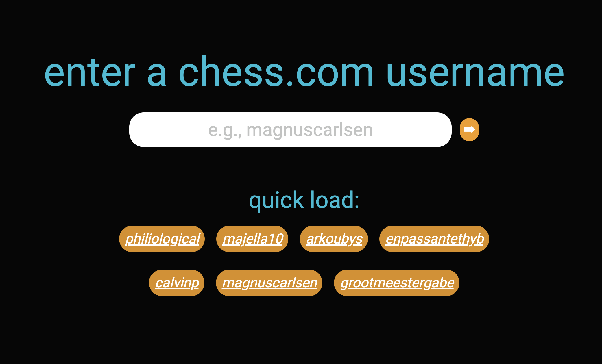
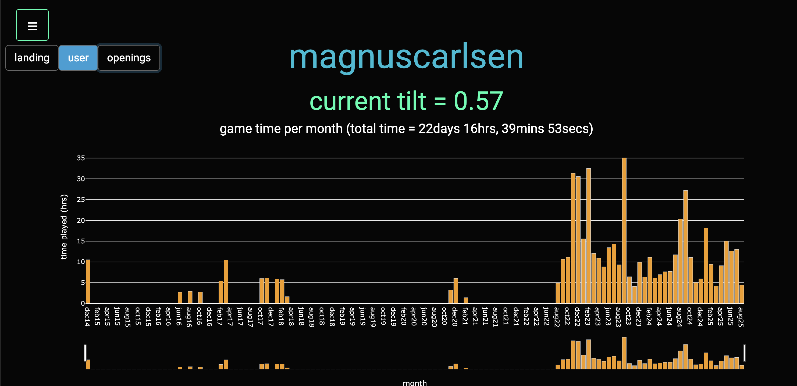
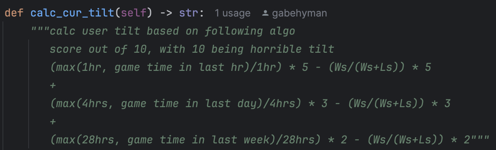
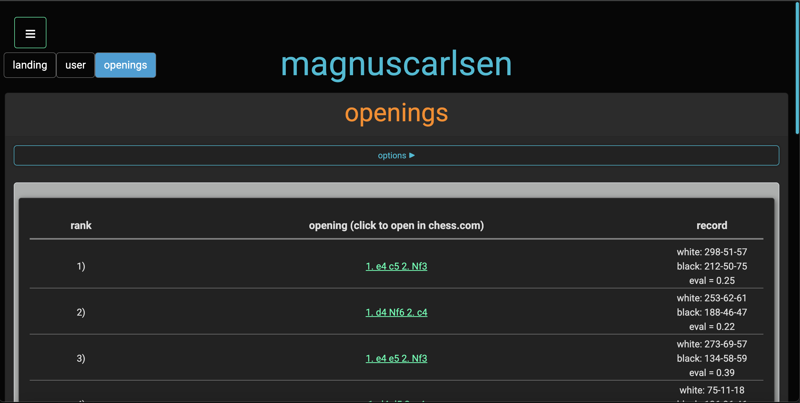
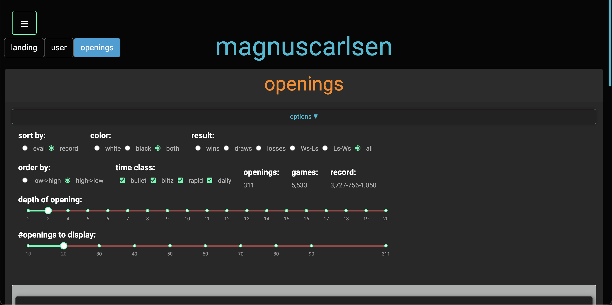

# chess_please

this is a webpage app that i've been developing to help my analyze my chess activity in a way that chess.com currently does not provide. ultimately, i hope this helps me (and others) study and improve at chess more efficiently (still a long way to go).

when driver.py is run, the following landing page will open in a browser:

chess.com usernames can be inputted (with previously searched users being saved). the program will then go and pull all of the inputted users games and open to the following page:

this page (for now) displays two things:
- users current tilt
  - the idea here is to try and come up with an algorithm to quantify a user's current tilt (i.e., how badly they're playing). as an initial prototype, i have come up with the following algorithm which characterized tilt on a scale from 1-10, 10 suggesting horrible user play. this still needs to be refined and i would like to incorporate my analysis of engine evaluation (e.g., recent/frequent blunders -> higher tilt):
  - 

- an interactive plot showing time played vs months active
  - the x-axis of this plot can be modified to focus on specific regions of user activity and inidividual bars can be hovered over to get the specific number plotted. i plan to add more plots of this nature with additional information that can be customized (#games played, wins/losses, blunders/brilliant moves, etc.)

the navigation bar in the top left can then be used to go to the openings page:

this page contains tons of information about the inputted user's openings. the hyperlinked pgn can be clicked on to launch this chess.com's analyze page with this opening loaded. there are also tons of filters (as shown in the image below) that the user can modify to sort the openings to their liking.

filters:
- sort by:
  - whether the ranking of the openings are based on the inputted user's record or the evaluation at the particular position
- color:
  - only focus on games that the inputted user played as black, white or both
- result:
  - rank the games based on the number of wins, losses, draws, difference between wins and losses, difference between losses and wins or all
- mates (will show up if eval is selected in sort by):
  - whether to include only look at openings where mate is imminent, to exclude imminent mate positions or to inlcude
- order by:
  - sort high to low or low to high
- time class:
  - select which time class of games to be displayed
- openings, games and record:
  - number of openings, games and associated record based on the above selections (auto update)
- depth of opening:
  - how many moves into the match to be analyzed and displayed
- #openings to display:
  - length of the list of openings

note about multi-threading:

evaluating each position of every game of an inputted user is computationally expensive. initially, no sort of parallelization was implemented and the webpage would not load for the full duration it took to analyze each game of the inputted user (which could be upwards of 30mins). therefore, i implemented both a multi-threading scheme using concurrent.futures import ProcessPoolExecutor which resulted in the significant speed ups below.

on a macbook pro A4 with 10cores (5 for processing), processing time was improved by ~3.5x.

| users | serial | parallel | improvement |
|-----------|-------|-------|--------|
| majella10 (9583games) | 1856s  | 490s  | 3.8x |
| TrisManMan (6312games) | 1464s  | 421s  | 3.5x |
| phililogical (5823games) | 1036s  | 304s  | 3.4x |
| grootmeestergabe (2183games) | 380s  | 114s  | 3.3x |

additionally, the program is now designed to only need to complete the generic processing of the games (not including position evaluation) before being ready to be used. once this processing is done, all features are fully functional (evaluation-related pieces are greyed out) and the multi-threaded evaluation calculation commences. once this is done, evaluation-related pieces of the program automatically refresh and become available.

## future development:
- improve tilt algorithm to take board positions/moves into account
- click on an opening and takes you to a page with all games/lines you've played with that opening (essentially same as opening page but starting with the clicked opening)
- automatically highlight openings the user should work on (or plays well)
- render images of a position next to pgn so that position can be more easily visualized
- add more information to user page, including more customizable graphs and general information about the user
- extend functionality to also include lichess users